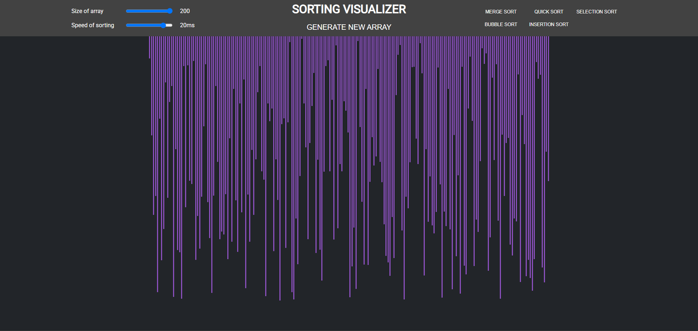
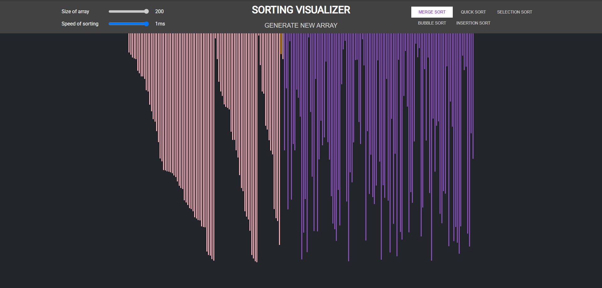
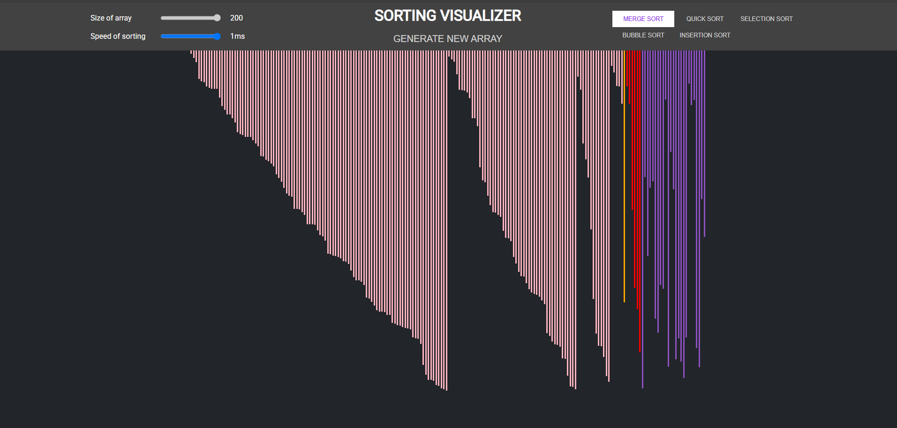
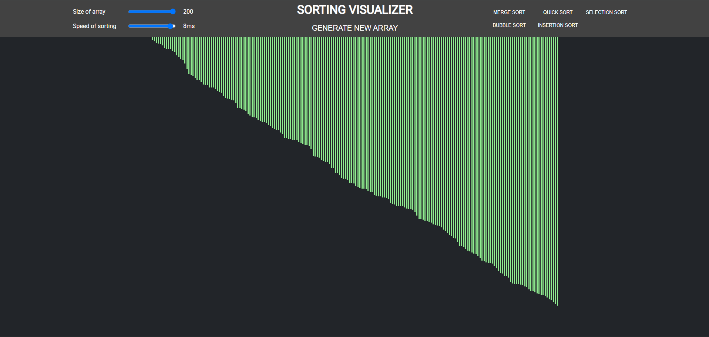

# 🧮 Sorting Visualizer

An interactive React-based web application that visually demonstrates how various sorting algorithms operate in real-time. Designed to aid in understanding the inner workings of sorting techniques through dynamic animations.

View the deployed project [here](https://gmolle-sorting-visualizer.web.app/)


---

## 🚀 Features

- ⚙️ **Real-Time Visualization** of:

  - Bubble Sort
  - Selection Sort
  - Insertion Sort
  - Merge Sort
  - Quick Sort
  - Heap Sort

- 🎛️ **Interactive Controls**:

  - Adjust array size
  - Modify animation speed
  - Generate new random arrays
  - Start, pause, and reset sorting animations

- 🎨 **Dynamic Visual Feedback**:

  - Color-coded bars representing different states:
    - Comparing elements
    - Swapping elements
    - Sorted position

- 📱 **Responsive Design**:
  - Seamless experience across desktops, tablets, and mobile devices

---

## 🛠️ Tech Stack

- **Frontend**: React, Tailwind CSS
- **State Management**: Redux
- **Animations**: CSS transitions

---

## 📦 Installation

```bash
# Clone the repository
git clone https://github.com/gmolle/Sorting-Visualizer.git
cd Sorting-Visualizer

# Install dependencies
npm install

# Start the development server
npm start
```

## 📷 Screenshots

<p>
  
  <br/>
  <em>Default view of visualizer</em>
</p>
<p>
  
  <br/>
  <em>Merge Sort in progress</em>
</p>
<p>
  
  <br/>
  <em>Merge Sort continued</em>
</p>
<p >
  
  <br/>
  <em>Sorting complete</em>
</p>
